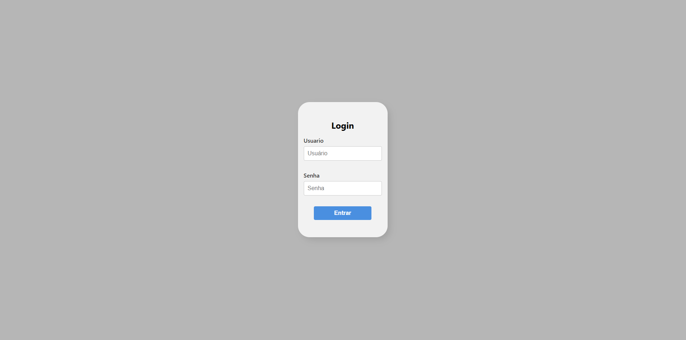
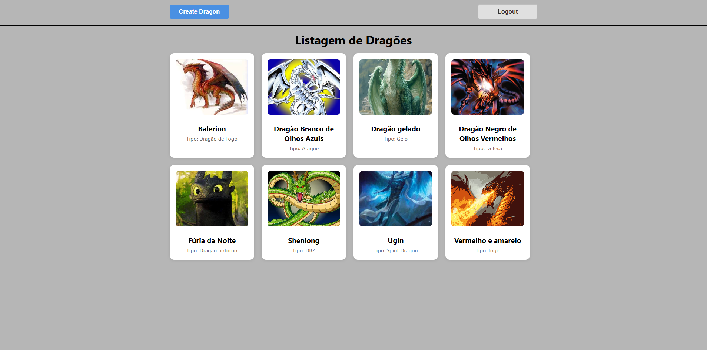
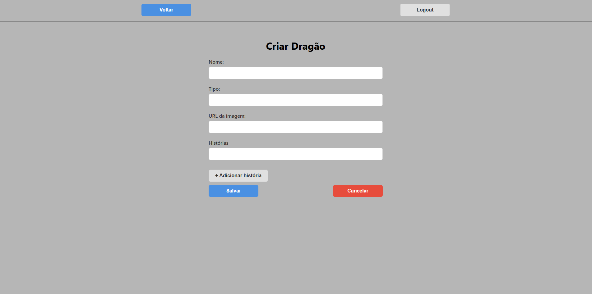
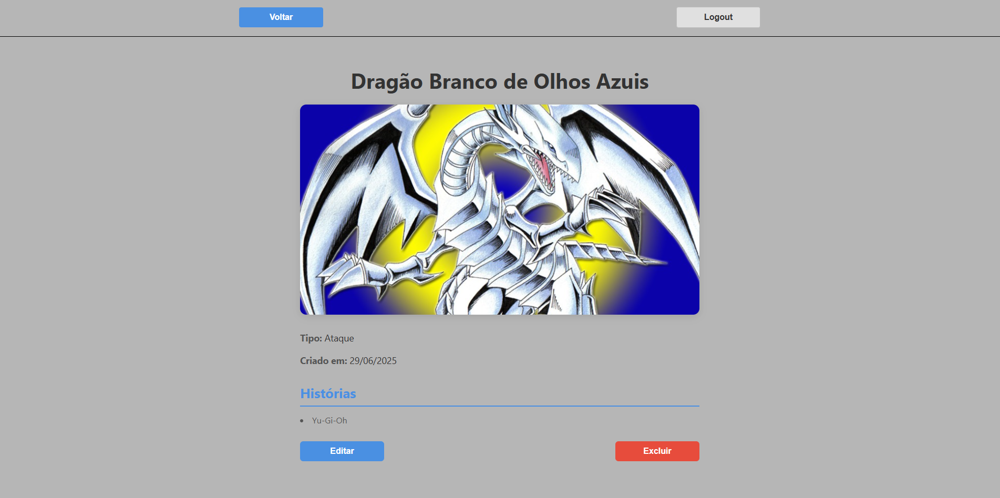

# 📌 Teste Front-End React Sicredi

## 1️⃣ O que é esta aplicação?

Esta é uma aplicação **React** desenvolvida para o teste de [**Front-End React**] na Sicredi.  
O objetivo é criar uma página de listagem de Dragões consumindo a API fornecida. Através desta aplicação é possivel listar os dragões em ordem alfabética, visualizar detalhes de um
dragão específico, editar um dragão, excluir e criar um dragão. O acesso as páginas citadas só pode ser realizado caso o usuário tenha realizado o login na aplicação, caso contrário
a única tela acessivel será a tela de login.

[**Usuário e senha para acesso:**]:  
**Usuário**: admin  
**senha**: 1234

---

## 2️⃣ Telas da aplicação

A aplicação possui as seguintes telas:
- **Tela de Login:** [Tela onde é possivel realizar o login para acessar a aplicação]   
- **Página inicial:** [Página onde será exibida a listagem de Dragões, onde será possivel selecionar um dragão, navegar até a página para criar um novo dragão e realizar logout]  
- **Página para visualizar um Dragão específico e excluir:** [Página onde será exibida as informações de um dragão especifico e também onde pode excluir o mesmo]  
- **Página para Modificar um Dragão** [Através dessa página é possivel modificar informações de um dragão ou exclui-lo]
- **Página para criação de um Dragão:** [Através dessa página é possivel criar um dragão]  

**Exemplos de telas:**  
| Tela | Descrição |
|------|------------|
|  | Tela de login do usuário |
|  | Página inicial com listagem de dragões |
|  | Página para criar um dragão |
|  | Página para modificar um dragão |
|  | Página para exibir detalhes de um dragão especifico e excluir |
---

## 3️⃣ Como executar o projeto localmente

Siga os passos abaixo para clonar e rodar a aplicação na sua máquina:

```bash
# Clone o repositório
git clone https://github.com/caducasara/teste-sicredi.git

# Acesse a pasta do projeto
cd PASTA_ONDE_ESTA_O_PROJETO

# Instale as dependências
npm install

# Execute a aplicação em modo de desenvolvimento
npm start
```

Após executar os comandos o projeto estará sendo executado no seguinte endereço http://localhost:3000/

## 4️⃣ Testes

Esta aplicação conta com **testes unitários** e **testes de integração** para garantir a qualidade e a confiabilidade do código.

- ✅ **Testes unitários**: Validam funções puras e componentes isolados.
- ✅ **Testes de integração**: Verificam fluxos completos de navegação e interação entre componentes e páginas.

Para executar os testes localmente, utilize o comando abaixo:

```bash
npm test
```

## 5️⃣ Tecnologias utilizadas  

Esta aplicação foi construída com as seguintes tecnologias e bibliotecas principais:

- React
- TypeScript
- React Router
- Jest
- React Testing Library
- Axios